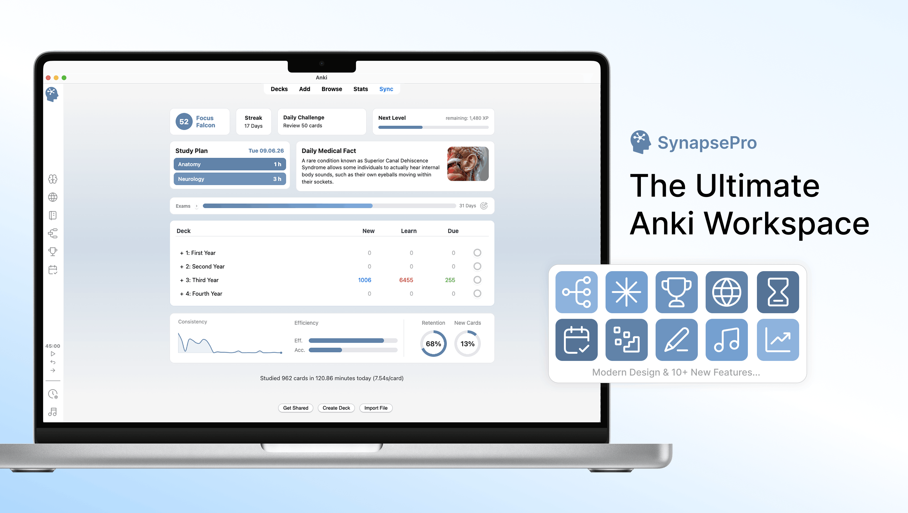

# SynapsePro for Anki

  

  A modern, all-in-one workspace that brings planning, focus, organization,
  insights, and motivation directly into Anki Desktop.

  <a href="https://www.synapse-pro.de">Website</a> ·
  <a href="https://github.com/mobesamedia/SynapsePro/issues">Report an issue</a> ·
  <a href="mailto:help.synapse.pro@gmail.com">Support</a>

## About SynapsePro

SynapsePro extends Anki with an integrated productivity environment designed to
keep your study workflow in one place. Plan sessions, track progress, organize
notes and PDFs, create mind maps, use focus tools, and stay motivated through
gamification—without leaving Anki.

## Highlights

| Study & planning | Knowledge workspace | Motivation & insights |
| --- | --- | --- |
| Daily study plans | Notebook and task lists | XP, ranks, and streaks |
| Deadlines and countdowns | Built-in PDF viewer | Measurable daily challenges |
| Pomodoro and session timers | Mind maps with recall hints | Review statistics and trends |
| Grade-focused study modes | Website sidebar and web search | Session summaries and earned XP |

Additional features include:

- A configurable launcher sidebar with keyboard shortcuts
- An optional AI assistant supporting OpenAI, Gemini, Anthropic, OpenRouter,
  Ollama, and llama.cpp-compatible servers
- A redesigned music player with local audio and optional SoundCloud support
- Light and dark modes, multiple color themes, and multilingual interface text
- Full-screen workspaces for Notebook, Mind Map, and Website Viewer

## What's new in 1.4.0

- Full-screen workspaces provide more room for Notebook, Mind Map, and Website Viewer
- Improved PDF viewing with 100% default zoom, text selection, and quick access to Anki's card editor
- Active-recall conceal/reveal tools, folders, and linked subpages in Notebook
- Redesigned Settings, Pomodoro controls, and Music Player
- New Dashboard study-history graph and improved challenge progress tracking
- Resizable Mind Map nodes, optional recall hints, and enhanced study-session summaries
- General stability, usability, and interface improvements

## Requirements

- Anki Desktop 25.09.4 or newer
- Windows, macOS, or Linux with Anki's bundled Qt 6 WebEngine
- Internet access only for features that deliberately use an online service,
  such as cloud AI providers, SoundCloud, or the website sidebar

AnkiMobile and AnkiDroid do not load desktop add-ons.

## Installation

### AnkiWeb

1. In Anki Desktop, open **Tools → Add-ons → Get Add-ons**.
2. Enter the SynapsePro add-on code shown on its AnkiWeb page.
3. Restart Anki.

### Manual installation

1. Quit Anki completely.
2. Place the downloaded SynapsePro folder inside Anki's `addons21` directory.
3. Start Anki again.

## Privacy and online features

SynapsePro is primarily a local desktop add-on. After you accept the onboarding
privacy notice, it sends selected setup categories and version information once
to the developer's Supabase database. It does not include card content,
learning statistics, names, email addresses, credentials, or device identifiers.

Online features connect only when required or used. AI requests go directly to
the provider you select, and API keys are stored locally in the current Anki
profile. See [PRIVACY.md](PRIVACY.md) for complete details about data storage and
network behavior.

AI output and bundled daily facts may be inaccurate. They are study aids and
not medical, legal, or other professional advice.

## Support

If you encounter a problem, please include your operating system, Anki version,
SynapsePro version, steps to reproduce the issue, and relevant lines from
**Help → About → Copy Debug Info**.

Never include API keys, private card content, or personal URLs in a report.

- Email: [help.synapse.pro@gmail.com](mailto:help.synapse.pro@gmail.com)
- Issues: [github.com/mobesamedia/SynapsePro/issues](https://github.com/mobesamedia/SynapsePro/issues)
- Website: [synapse-pro.de](https://www.synapse-pro.de)

## License

The source code is licensed under the [MIT License](LICENSE). SynapsePro
branding, images, animations, and audio are excluded and remain All Rights
Reserved by MobesaMedia. Licenses for bundled third-party libraries are listed
in [THIRD_PARTY_NOTICES.md](THIRD_PARTY_NOTICES.md).

